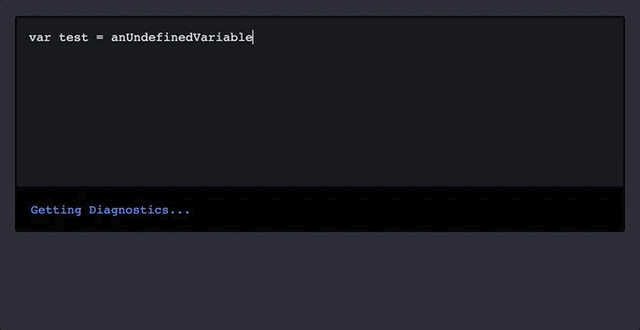

# JSON RPC / LSP Notes

Hello, these are some notes I took while exploring JSON RPC / Microsoft Language Server Protocol.

These start with rpc basics (i never used before!) and ends with running a typescript language server to parse a `<textarea>`



## Examples / Notes:

- [RPC Basics](./notes/0_rpc.md)
- [JSON RPC](./notes/1_json_rpc.md)
- [LSP Basics](./notes/2_lsp.md)
- [LSP Using External Server](./notes/3_lsp_external.md)
- [LSP Browser Textarea](./notes/4_lsp_textarea.md)


## How to run examples 0-4

```
npm install
npm run example_X
```


# References
- rpc: https://en.wikipedia.org/wiki/Remote_procedure_call
- json-rpc: https://www.jsonrpc.org/
- lsp: https://github.com/microsoft/vscode-languageserver-node/tree/main/jsonrpc
- lsp github: https://github.com/microsoft/vscode-languageserver-node/tree/main/jsonrpc
